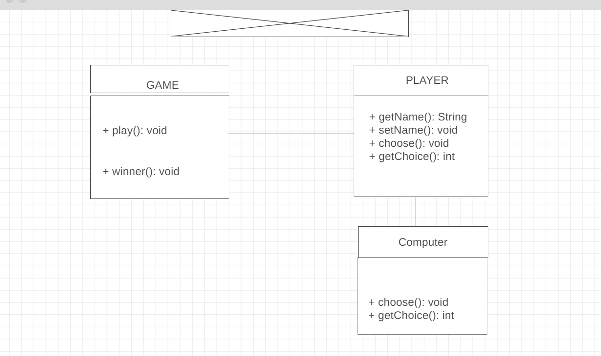

# Java-Mini-Project---RPS

## Description
This is a Java implementation of the classic game "rock-paper-scissors". The game has a main menu with options to enter two players or play against the computer. When playing against another human, players can take turns playing rock, paper, or scissors. When playing against the computer, the computer will randomly choose its move. The winner of each round is determined according to the rules of the game: rock beats scissors, scissors beats paper, and paper beats rock. The game continues until a player reaches a specified number of points, at which point the winner is declared.

## Table of Contents
- Wireframe
- Installation
- Usage
- Contributing
- License

## Wireframe / Class Diagram

### classes and methods
- Main Class: Game
- Class two: Player (abstract)
- Class Three: Computer (sub-class)
- Main Methods: Winner(), play(), choose()
- Secondary Methods: getName(), setName(), getChoice()[2]

## Installation
To run the game, you will need to have Java installed on your computer. You can download Java [here].

Once you have Java installed, you can download the source code for the game from the GitHub repository and compile it using your favorite Java compiler.

## Usage
To start the game, run the compiled Java file from the command line. You will be prompted to select whether you want to play against another player or the computer. Follow the on-screen instructions to play the game.

## Contributing
Contributions to the project are welcome! If you would like to contribute, please fork the repository and submit a pull request.
